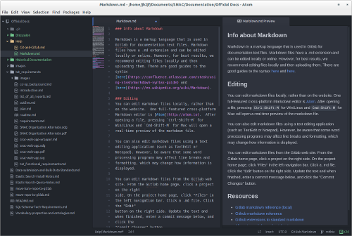

### Info about Markdown

Markdown is a markup language that is used in Gitlab for documentation text files. Markdown files have a .md extension and can be edited locally or online. However, for best results, we recommend editing files locally and then uploading them. There are good guides to the syntax [here](https://confluence.atlassian.com/stash/using-stash/markdown-syntax-guide) and [here](https://en.wikipedia.org/wiki/Markdown).

### Editing
You can edit markdown files locally, rather than on the website.  One full-featured cross-platform Markdown editor is [Atom](http://atom.io).  After opening a file, pressing `Ctrl-Shift-M` for Win/Linux and `Cmd-Shift-M` for Mac will open a real-time preview of the markdown file.

You can also edit markdown files using a text editing application (such as TextEdit or Notepad). However, be aware that some word processing programs may affect line breaks and formatting, which may change how information is displayed.  

You can edit markdown files from the Gitlab web site. From the Gitlab home page, click a project on the right
side. On the project home page, click "Files" in the left navigation bar. Click a .md file. Click the "Edit"
button on the right side. Update the text and when finished, enter a commit message below, and click the
"Commit Changes" button.

### Resources

* [Gitlab markdown reference (local)](http://gitlab.iath.virginia.edu/help/markdown/markdown.md)
* [Github markdown reference](https://help.github.com/articles/markdown-basics/)
* [Github extensions to standard markdown](https://help.github.com/articles/github-flavored-markdown/)
* [Alternate markdown cheatsheet](https://github.com/adam-p/markdown-here/wiki/Markdown-Cheatsheet)
* [Official Markdown documentation](http://daringfireball.net/projects/markdown/)
