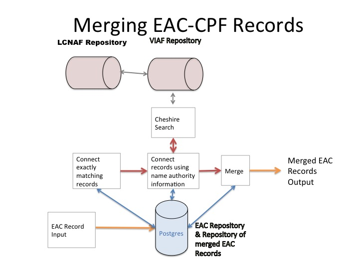

July 16 2015: Do not edit this file. Newer files here supercede the information here.

TAT Functional Requirements

Authors
=======

Tom Laudeman, Technical lead, University of Virginia, Institute for
Advanced Technology in the Humanities
[twl8n@virginia.edu](mailto:twl8n@virginia.edu)

Brian Tingle, Technical Lead for Digital Special Collections, California
Digital Library

Rachael Hu, User Experience Design Manager, California Digital Library

Ray R. Larson, U.C. Berkeley - School of Information

(other authors add yourselves here)

### Discussion items:

What are .c and .r files in the merged data?

If an .c file is creatorOf (presumably a resourceRelation) where is that
preserved in the merged data? Check this out vis-a-vis the cpf SQL db.

Edit UI data field validation API

Most data entry needs validation, so we should plan for a validation
layer that interacts with the UI and with the database. The ideal
architecture is rule based validation as opposed to some hard coded ad
hoc system. It would be even better if the rules were saved to the
database and had a UI of their own, allowing non-programmers to update
data validation rules (and the concomitant messages show to users when
there is a validation error).

#### Edit architecture requirements

Daniel proposes a plan (which implies important requirements) that human
edits are applied to a serialized description, and after the first human
edit, the description is always maintained inside the system in the
serialized form. Prior to edits, a description consists internally of
one or more CPF records which are serialized in real time via a specific
blending algorithm for display/viewing. The edit UI displays the
serialized description as it would be viewed in the public discovery web
page. After the first human edit there is no further need to serialize,
so we would disable serializing. (If serializing is disabled after human
edits, does this impact any other real-time rendering features or
formatting that are part of the serializing process? If so, these
processes must also be applied to the post-human-edit description in
real time.)

Prior to human edits, merged records can be algorithmically split by the
computer, assuming we write code to perform such a split. After human
edit, a description split must be performed by a human. Daniel proposes
that all previous versions can be viewed (read-only) during the
human-mediated split operation so the human can refer back to previous
information.

After human edits, rollback only applies to human edited versions. There
is a fire-break where rollback cannot cross from human edits back to
machine-merged descriptions.

#### Merge and watch

If a file is being watched, and that file is part of an description
(merged or single) then the watch will apply to the results of human
edits, regardless of which part of the description was modified. It is
possible for someone to wish to track a biogHist, but that biogHist
could be completely removed in lieu of an improved and updated
description. We do not track individual elements in CPF. We only track
an entire description, regardless the watcher’s motivation. The original
motivation for watching might no longer exist after an edit, and if so,
the watcher can simply disable their watch. After each edit, all
watchers will get a notification. The watch does not apply to any single
field, but to the entire description, and therefore also to future
descriptions which result from merging.

What happens to a watch on a merged description which is subsequently
split? Does the watch apply to both split descriptions or to neither
description? Perhaps is it best to disable the watch, and inform the
watcher to re-apply to watch a specific record, along with links and
helpful info to make it easy to add the new watch.

#### Brian’s API docs need to be merged in or otherwise referred to:

[https://gist.github.com/tingletech/4a3fc5f59e5af3054286](https://www.google.com/url?q=https%3A%2F%2Fgist.github.com%2Ftingletech%2F4a3fc5f59e5af3054286&sa=D&sntz=1&usg=AFQjCNEJeJexryBtHbvLw-WtFYjxP4VwlQ)

### Not sure where to fit these topics into the requirements. Some of them may not be part of technical requirements:

Consider implementing linked data standard for relationship links
instead of having to download an entire document of links (as it is
configured now.)

Sort by common subject headings across all of SNAC - right now SNAC has
subject headings that have been applied locally without common practice
across the entire corpus.

Sort by holdings location. Sort by identity's activity location. Sort
and visualize a person through time (show dates for events in a person
or organization's lifetime). Sort and visualize an agency or
organization as it changes over time.

Continue to develop and refine context widget.

Sort collection links. Add weighting to understand which collections
have more material directly related to identity. (How is this best
handled programmatically or as an input by contributors- maybe both?).

Increase exposure of SNAC to general public by leveraging partnerships.
Suggested agreement with Wikipedia to display Wikipedia content in SNAC
biographical area and work with Wikipedia to allow for links to SNAC at
the bottom of all applicable identities. This would serve to escalate
and  drive traffic to SNAC.

Introduction (Tom, Ray, Sara, Brian, Daniel)
============================================

Social Networks and Archival Context (SNAC) is a Mellon-funded project
to aid end-user researchers in discovering, locating, and using
distributed historical record descriptions, especially as relates to
corporate bodies, persons, and families (CPF). These descriptions are
often in finding aids, and they often exist in electronic format. They
are distributed across many geographical locations and many networks.
SNAC brings all this data together in a central system, while retaining
links to the original descriptions. Critically, SNAC attempts to merge
descriptions for the same [matching?] CPF identities, linking those
descriptions to a single authoritative name.
^[[a]](#cmnt1)^^[[b]](#cmnt2)^

We have an existing system (SNAC one?) and need additional work to get
to a new system (SNAC 3?), so part of this document is gap analysis. The
scope of this document is to outline technical specifications and
requirements for a production system for the Cooperative
phase^[[c]](#cmnt3)^ of SNAC. This production system will handle
ingestion, processing, matching/merging, discovery, and dissemination of
archival descriptions that are submitted and added to the Cooperative.  

Evaluation of Existing Technical Architecture
=============================================

Overview (All authors)
----------------------

This section describes the existing technical architecture, and later
moving on to describe the required functionality for the production
system for the Cooperative.

Many of the archival records that are ingested in SNAC are Encoded
Archival Context - Corporate bodies, Persons and Families (EAC-CPF,
hereafter CPF) records. EAC-CPF is an XML schema endorsed as a standard
by the Society of American Archivists. We speak of CPF descriptions in
the sense of a “computer record”: often a single text file and not a
“record” in the archival sense.

“Linked data” technology related to the Resource Description Framework
is also employed to manage some controlled vocabularies in the project.

The current system consists of three main components: extraction,
match/merge, discovery. Extraction consists of extracting data from
incoming archival description records (primarily EAD, MARC21 and some
other unique formats), to create CPF descriptions. Match/merge is to
process the CPF descriptions in search of name matches and to merge
well-matched descriptions. The resulting data set includes merged
descriptions and descriptions with no matches (called singletons), all
in a single database. Discovery is discovery and dissemination of the
data via a web application.

The production system will have two additional components: maintenance
and administration. Maintenance includes manual corrections, such as
correcting data within a description, splitting incorrect merges,
merging descriptions for the same CPF identity, and description embargo
(embargo hides descriptions from public view for either technical or
administrative reasons). Administration is the typical management of
users, accounts, and reporting on the state of the system.

The first two phases of data processing are extraction, and match/merge.
A database of descriptions, both merged and unmerged is the end
result^[[d]](#cmnt4)^. The process of ingesting extracted data and
merging will continue for the life of the project. An extensive
web-based search engine lets users discover descriptions.

We use the term “merged” loosely when applied to the automated system
since the final database may contain descriptions which should be
merged, but which a computer is unable to reliably determine.  We take a
conservative approach, preferring to only merge descriptions that a
computer program can accurately distinguish.^[[e]](#cmnt5)^ Even so,
some descriptions will have been incorrectly merged, and thus the need
for a (future) maintenance system that allows manually splitting of
descriptions, among other things.

Both Extraction and Match/merge are script based, batch processing,
semi-automatic processes managed entirely by software engineers.
Discovery and Maintenance are both web applications with extensive
public user interfaces intended for researchers. Administration is done
mostly via a non-public web application.

Extraction and match/merge are well developed, although we have some
planned improvements. Discovery is well developed, but existing features
are being refined, and adding new features is on-going. Maintenance and
administration have not yet been created and must be written from the
ground up.

Current State of the System (Tom, Ray, Sara, Brian, Daniel)
-----------------------------------------------------------

CPF description generation is done at the University of Virginia’s
Institute for Advanced Technology in the Humanities (IATH). IATH handles
the CPF data extraction and hosts servers for data processing and the
SNAC prototype web site. Data processing, XTF indexing (for the
discovery interface), and web hosting take place on a Linux server with
24 CPUs and 94 GB of RAM connected to a 1Gbit network switch. This
server is administered by the IATH sysadmin team. \

Collections of archival description computer descriptions in a variety
of formats are extracted into CPF format XML. This process involves
writing XSLT scripts that extract and transform input descriptions, and
create CPF files as output. The current state of the extraction is a
collection of XSLT scripts supplemented by Perl scripts. The input files
are XML with large numbers of files in EAD, MARC XML, and British
Library XML, as well as several smaller data sets.  A large XSLT code
library is shared among most of the extractions. Each type of extraction
builds a generic internal data structure, which is serialized as EAC-CPF
XML output. The XSLT takes into account various descriptive practices in
the input data, and reformats as necessary to create a single type of
normative CPF output. The complexity of this task centers around the
large number of small differences in descriptive practice. Currently
more than 3 million CPF computer descriptions have been created. The
XSLT processor is Saxon 9 HE, which is the free “home edition” of Saxon.
Saxon implements XSLT 2.0. There are a small number of Perl scripts that
integrate the XSLT into a pipeline, automating tasks such as chunking
data sets into sizes that won’t exceed computer memory.

The current state of the match/merge is (filled in by Yiming/Ray/Sara,
initially a one or two paragraph overview with more detail added later
as necessary).

Overview of Brian’s UI and programming for the SNAC2 XTF discovery tool
(add this to another item if there is an umbrella section more
appropriate).

Is XTF the only discovery tool we will offer? Will SNAC be fully indexed
by Google and Bing?

TK The involvement of the UC Berkeley I School includes the development,
testing and modification of the matching and merging components of the
SNAC system. The current system, described in more detail below, takes
the EAC-CPF records derived from the various source institutions and
compares the names and associated information (especial dates) to
identify the records that likely describe the same person,

organization, or family. The process involves not only comparison across
input records, but also comparison with information from the Virtual
International Authority File, and approximate matching for these records
as well.

TK The involvement of CDL includes … (Brian)

TK We have several extant user studies UI/UX … (Rachael, on-going)

TK The results of these studies are … (Rachael, on-going)

TK The technical implications of these studies are … (Rachael, on-going)

The current system uses a fairly loose software development process.
Source code is primarily maintained on a Linux server which is managed
by standard practices as relate to hardware, software, network, user
accounts, back up, and so on. All the data resides on the server. Source
code is managed by version control systems. The amount of quality
assurance and testing has been increasing over time, as well as
documentation, and management aspects such as release process. All tools
currently used are open source, and the code written for SNAC is open
source. We have begun to formalize feature request and issue tracking.
The development process is agile in that there are frequent small
changes that are committed to the version control, and the code is
nearly always in a working state.

### Processing Pipeline (Ray, Yiming, Sara)

TK Describe algorithmic portions, and add a section for new features.

Extraction (Tom, Daniel)
------------------------

There are currently several CPF extraction software pipelines: MARC21,
British Library, Smithsonian Agency History, New York State Archives,
Smithsonian Joseph Henry, Smithsonian Field Books, and EAD from nearly
60 institutions.

The first step in adding new records to the SNAC database is to convert
incoming data into EAC-CPF XML.  One EAC-CPF record is created for each
successfully extracted reference to an identity from an archival source.
The processing also allows for some degree of remediation of data
quality issues and serves to normalize the data into a common format.
 Scripting data transformation processes is a significant task that
often requires close communications with data contributors and
customizations to accommodate local practices of the contributors.

Creating an extraction is a complex process since we must deal with
variances in local descriptive practice. The MARC21 tools have been made
available as a web interface and this demonstrates the feasibility of
moving more of the processing responsibility to data donors. If we are
optimistic, we hope that EAD-to-CPF extraction and all other types of
future extractions can be turned into donor-driven tools. Specifically,
we create the tools and then deploy them as web applications and/or
desktop applications. Web hosted extraction tools allow us to leverage
the power of our servers and programmers so that data donors do not need
a large computing infrastructure in order to participate. In any case,
data must be validated before ingest into the match/merge processing.

XSLT and perl are the predominate technologies used in the generation of
the XML documents created by this process.  The code architecture
focuses on reusability of modular routines to facilitate maintenance of
the customizations needed accommodate the diversity of data sources.

Code, sample data, and documentation are in Github. The pipeline is
being run on a server, but the hardware requirements are minimal enough
that most laptop computers could run the extraction. The system requires
unix-like features of Linux, MacOS, or cygwin (for MS Windows). The XSTL
engine is Saxon 9.x HE which is the free, public version of Saxon.

Match/Merge (Brian, Yiming, Ray)
--------------------------------

The match/merge process has three major data input streams, library
authority records, EAC-CPF documents from the EAC-CPF extract/create
system, and an ARK identifier minter.

First, a copy of the Virtual International Authority File (VIAF) is
indexed as a reference source to aid in the record matching process.  In
addition to authorized name headings from multiple international
sources, the VIAF data contains biographical data and links to
bibliographic records which will be included in the output documents.  
Then, the EAC-CPF from the extract/create process are serially processed
against the VIAF and each other to discover and rate potential matches
between records.  In this phase of processing, matches are noted in a
database.

After the matching phase identifies incoming EAC-CPF to merge, a new set
of EAC-CPF records are generated.  This works by running through all the
matches in that database, then reading in the EAC-CPF input files, and
finally outputting a new EAC-CPF records that merges the source EAC-CPF
with any information found in VIAF.  ARK identifiers are also assigned.
This architecture allows for incrementally processing more un-merged
EAC-CPF documents before. It also allows matches to be adjusted in the
database, or alterations to be made on the un-merged EAC-CPF documents,
and the merge records can be regenerated.

Cheshire, postgreSQL, and python are the predominate technologies used
in the generation of the XML documents created by this process.

[link to the merge output spec]

This involves processing that compares the derived EAC-CPF records
against one another to identify identical names. Because names for
entities may not match exactly or the same name string may be used for
more than one entity, contextual information from the finding aids is
also used to evaluate the probability that closely and exactly matching
strings designate the same entity.[1] For matches that have a high
degree of probability, the EAC-CPF records will be merged, retaining
variations in the name entries where these occur, and retaining links to
the finding aids from which the name or name variant was derived. When
no identical names exist, an additional matching stage compares the
names from the input EAC-CPF records against authority records in the
Virtual International Authority File (VIAF). Contextual information
(dates, inferred dates, etc.) is used to enhance the accuracy of the
matching. Matched VIAF records are merged with the input derived EAC-CPF
records, with authoritative or preferred forms of names recorded, and a
union set of alternative names from the various VIAF contributors, will
also be incorporated into the EAC-CPF records. When exact matching and
VIAF matching fail, then we attempt to find close variants using Ngram
(approximate spelling) matching. In addition contextual information,
when available is used assess the likelihood of the records actually
being the same. Records that may be for the same entity but the
available contextual information is insufficient to make a confident
match will be flagged for human review (as “May be same as”). While
these records will be flagged for human review, the current prototype
does not provide facilities to manually merge records. The current
policy governing matching is to err on the side of not merging rather
than merging without strong evidence.

The resulting set of interrelated EAC-CPF records will represent the
creators and related entities extracted from EAD-encoded finding aids,
with a subset of the records enhanced with entries from matching VIAF
records. The EAC-CPF records will thus represent a large set of archival
authority records, related with one another and to the archival records
descriptions from which they were derived. This record set will then be
used to build a prototype corporate body, person, and family name and
biographical/historical access system.

In the current system all input records, and potential matches are
recorded in a relational database with the following structure:

* * * * *

[1] Using contextual information in determining that two or more records
represent the same entity has been successful in matching and merging
authority records in an international context. See Rick Bennett,
Christina Hengel-Dittrich, Edward T. O'Neill, and Barbara B. Tillett
VIAF (Virtual International Authority File): Linking Die Deutsche
Bibliothek and Library of Congress Name Authority File:
http://www.ifla.org/IV/ifla72/papers/123-Bennett-en.pdf

The the current processing steps are summarized in the following
diagram:

Discovery/Dissemination (Brian, Rachael)
----------------------------------------

Prototype research tool^[[f]](#cmnt6)^
--------------------------------------

The main data input for the prototype research tool are the merged
EAC-CPF documents produced in the match/merge system.  Some other
supplemental data sources, such as dbpedia and the Digital Public
Library of America are also consulted during the indexing process.

A pre-indexing phase is run on the merged EAC-CPF documents.  During
pre-processing, name headings and wikipedia links are extracted, and
then used to look for possible related links and data in supplemental
sources. The output of the pre-indexing phase consists of XML documents
recording supplemental.

Once the supplemental XML files are generated, two types of indexes are
created to power which serve as the input to the web site.  The first
index created runs across all documents and provides access to the full
text and specific facets of metadata extracted from the documents.
 Additionally, the XML structure of each document is indexed as a
performance optimization that allows for transformations to be
efficiently applied to large XML documents.

The public interface to the prototype research tool utilizes the index
across all documents to enable full text, metadata, and faceted searches
of the merged EAC-CPF documents.  Once a search is completed, and a
specific merged EAC-CPF document is selected for display; the index of
the XML document structure is used to quickly transform the merged
document into an HTML presentation for the end user.

In the SNAC1 prototype a graph database was created after the full text
indexing was complete.  The graph database was used to power
relationship visualizations and an API used to dynamically integrate
links to SNAC into archival description access systems. This graph
database was then converted into linked data, which was loaded into a
SQARQL endpoint. This step has not yet been implemented in the SNAC 2
prototype.  Because the merged EAC-CPF documents are of higher quality
for the SNAC 2 prototype, the graph extraction process is no longer
dependent on the full text index being complete, so it could run in
parallel with pre-indexing and indexing.

XTF is the main technology used to power public access to the merged
EAC-CPF records.  XTF integrates lucene for indexing and saxon for XML
transformation, making heavy use of XSLT for customization and display
of search results and the merged documents.  EAC-CPF and search results
are transformed to HTML5 and JSON for consumption by the end users’ web
browser.  Multiple javascript and CSS3 libraries and technologies are
used in the production of the “front end” code for the website.  Google
analytics is used to measure use of the site.  Werker, middleman, and
bower used to build the front end code for the site.

This technical architecture

[links to code]

Gap analysis
------------

This is gap analysis between the current and SNAC2-prototype. Perhaps
this should be in the Required and Planned Functionality below.

Data maintenance
----------------

A goal of the pilot phase it to demonstrate cooperative maintenance of
the data resource.  The prototype does not have robust support for
maintaining the corpus of EAC-CPF identity documents.

While the current architecture supports the incremental addition of new
records through input to the match/merge system there is no way to
directly create a record for a known new identity.  A workflow that
includes an archival description operator looking up identities in the
system; and creating a new record if the identity they are trying to
reference does not exist; must be supported.^[[g]](#cmnt7)^ The new
maintenance system will allow creation of a new identity record via the
web interface.

With the current architecture, textual information that comes from the
un-merged EAC-CPF documents - such as biographical history notes - could
be maintained by editing the un-merged EAC-CPF source and re-exporting
the merged EAC-CPF document.  New information could be added to the
merged documents by adding another un-merged document into the input
directory.  New un-merged EAC-CPF documents containing ARKs could be
matched directly, bypassing the match/merge searching.  It is less clear
how factual information that comes from VIAF could be modified in the
current prototype.

Early research indicates the most import section of a merged EAC-CPF
document is the section that contains links to primary and secondary
research materials about the named identity. The overarching goal of
archival description it to enable researchers to find materials relevant
to their interests. In the current prototype, the only mechanism to add
a new link into the “Archival Collections” (a more accurate label would
be “Archival Materials”) or “Related Resources” sections of links would
be to generate an un-merged EAC-CPF record with the links and add run
that through the match/merge system.

The current prototype maintains information about relationships between
the entities described by the merged EAC-CPF documents.  Currently,
“associated with” and “corresponded with” are the only two relationship
types supported.  Early research suggests that archival description
practitioners are interested in using a more extensive vocabulary of
relationship types.

[ problem of linking to EAD if the URLs are not known ]

    •    establish procedures to accepting more batch submissions

    •    XTF is not designed to handle so many documents; XTF will can
not be run in a “clustered” mode; must scale up, not scale out

    •    Cheshire II does not have a Open Source Initiative certified
license

Pilot phase architecture
------------------------

Alternative 1^[[h]](#cmnt8)^
----------------------------

The most expeditious way to launch a pilot phase would be to leave the
basic technical architecture of the prototype in place, and to focus
initial energies into establishing policies and procedures that work
within the constraints of this architecture.  Two key systems that would
need to be set up for this approach to work are a customer relationship
management (CRM) system and ticketed help desk.

Customer relationship management systems have historically be used as a
sales support tool.  Information on current and potential customers,
including contact information and institutional affiliation, are
maintained in a database.  All pilot members institutions and designated
contacts should be entered into a CRM system for the pilot phase.  All
correspondence, call, contracts and agreements with accepted and
potential pilot phase members should be logged or stored in the CRM
system.^[[i]](#cmnt9)^

The CRM system should support or integrate with a help desk that issues
work ticket numbers. ^[[j]](#cmnt10)^ Any addition or change in the
maintained corpus of merged EAC-CPF records will require a work ticket
number.  Expectations for response times for issued tickets should be
established, clearly communicated, and measured for compliance.  A
customer service manager^[[k]](#cmnt11)^ will actively monitor the queue
of work tickets pending.  An operations manual will be maintained so
that the customer service manager or any additional first tier support
staff will be able to handle a set of ticket types.  If a procedure for
the request is not yet documented in the operations manual - or if the
manual indicates this is a task for second tier - then the ticket will
be escalated to the second tier support programmer.  The second tier
support programmer will have the technical skills to manipulate the
technical infrastructure; such as through editing XML files or directly
altering the database.  The second tier support programmer would also be
responsible for performing data extraction and normalization of non
EAC-CPF data sources processed during the pilot phase.^[[l]](#cmnt12)^ 
The volume and type of tickets will help establish priorities for
establishing procedures that can be automated for first tier support and
for future phases that do not require pilot members to contact the help
desk and obtain work tickets.

An automated way to establish a new identity should established early in
the pilot phase, so that participants can mint a new ARK identifier
without creating a work ticket.  Initially, a work ticket would still be
generated once the participant was ready to submit the new record though
the match/merge process.

Given the importance of maintaining links from the merged EAC-CPF record
to related resources, a link harvesting protocol should be developed
early in the pilot phase.  When a pilot phase participant identifies a
match in SNAC with a name they have in a collection description; the
link harvesting protocol would specify how to publish that link in their
HTML display of their collection description or through some other
mechanism (perhaps through an extension to the sitemap protocol, along
the lines of how ResourceSync works).  Procedures would be established
to then notify SNAC to harvest links from the participant, and the SNAC
“related collections” section would be automatically updated.  Such
updates would be based on a “linked data” technology rather than the
submission of XML files.

Alternative 2
-------------

Pure XML architecture for edits (edit the merged EAC-CPF records, maybe
with something like xEAC and with the merged files in revision control.
 This might make export from the match/merge challenging)

Alternative 3
-------------

Pure RDF architecture

Current State Conclusion (All, Daniel, Tom)
-------------------------------------------

The current systems functions well enough for researchers and other
stakeholders to see large data sets fully processed. These systems will
benefit from additional work to make them more mature in the usual ways
that software develops: robustness, testing and QA, documentation,
examples, consistent API. Most of the current software will be used in
the production product.

Required and Planned Functionality (All authors)
================================================

(We need to break out each item into UI functionality, and API
functionality.)

Expanded CPF schema requirements
--------------------------------

Provenance and history of each element/attribute.

Unique ID per element of CPF if that element is editable.

Version control on a per-element basis.

Expanded Database Schema
------------------------

The current database (Postgres) is sufficient for the current project
only. It will expand, and the expansion will probably be fairly
dramatic. We need to determine what tables and fields are necessary to
support additional functions. Each section of this document may need a
“data” section, or else this database schema section needs to address
every functional and UI aspect of all APIs that have anything to do with
the database.

Each field within CPF may (will?) need provenance meta data. Likewise
many fields in the database may need data for provenance.

The database needs audit trail ability to a fairly granular (field)
level. Audit is a new table at the very least. It seems likely that
nearly every table will gain some audit related fields.

Will database records be versioned? How is that handled? Seems like it
may be done via versioning table and some interesting joins. We need to
evaluate the various standard methods for database internal versioning.

CPF record has links to a “watch” table so users can watch each record,
and can watch for certain types of changes. Need UI for the watch
system. Need an API for the watch system.

Need a user table, group table, probably a group permission table so
that permissions are hard code with groups. We also want to allow
several permissions per group. Need UI for user, group, and
group-permission management.

If we create a generalized workflow system (as opposed to an ad-hoc
linked set of reports) then we need workflow tables. The tables would
establish workflow paths, necessary permissions, and would be linked to
users and groups.

Need fields to deal with delete/embargo. This may be best implemented
via a trigger or perhaps a view. By making what appear to be simple
SELECTs through a view, the view can exclude deleted records. We must
think about how using a view (or trigger) will effect UPDATE and INSERT.
Ideally the view is transparent. Is there some clever way we can
restrict access to the original table only via the view?

Need record lock on some types of records. This lock needs to be honored
by several modules, so like “delete”, lock might best be implemented via
a view and we \*only\* access the table in question via the view.

If there are different levels of review for different elements in the
record, then we need extra granularity in the workflow or the edited
record info to know the type of record edited apropos of workflow
variations.

If there different reviewers for different parts of the record, then
workflow data (and workflow configuration) needs to be able to notify
multiple people, and would have to get multiple reviewer approvals
before moving to the next phase of the workflow.

Institutional affiliation is probably common enough to want a field in
the user table, as opposed to creating a group for each institution. The
group is perhaps more generalized and could behave identical (or almost
identical) to a field (with controlled vocabulary) in the user table.

Make sure we can write a query (report) to count numbers of records
based type of edit, institution of the editor, and number of holdings.

If we want to be able to quickly count some CPF element such as outgoing
links from CPF to a given institution, then we should put those CPF
values into the SQL database, as meta data for the CPF record.

What is: How many referral links to EAC records that they created?

Be able to count record views, record downloads. Institutional dashboard
reports need the ability to group-by user, or even filter to a specific
user.

Reporting needs to help managers verify performance metrics. This
assumes that all changes have a date/timestamp. Once workflow and
process decisions are set, performance requirements for users such as
load/performance (how many updates and changes to records can be handled
at once), search response time, edit time (outside of review workflow),
and update times need to be set.

Effort reporting to allow SNAC and participants to communicate to others
the actual level of effort involved. This sounds like a report with time
span and numbers of records handled in various ways. SNAC might use this
when going from pilot into production so that everyone knows what effort
will be required for X number of records/actions (of whatever action
type).

Time/activity reporting could allow us to assess viability, utility, and
efficiency of maintenance system processes.

Similar reports might be generated to evaluate the discovery interface.
Something akin to how much time was required to access a certain number
of records. Rachael said: Assess viability of access funtionality-
performance time, available features, and ease of use.

We could try to report on the amount of training necessary before a new
user was able to work independently in each of various areas (content
input, review, etc.)

Introduction to Planned Functionality
-------------------------------------

The current system works, but is somewhat skeletal. It requires careful
attention from the developers to run the data processing pipelines. It
lacks administrative controls and reporting. Existing software
development process follows modern agile practices, but the some
processes are weak or incomplete. The research tools are somewhat
rudimentary. It needs infrastructure where domain experts can correct
and update merged authority descriptions.

The functional requirements below specify in detail all of the
capabilities of the new [production?] system. A separate section about
user interface (UI) specifies the visual/functional aspects of the UI
and includes discussion of the user experience (UX). Some of the
functional requirements exist only to support actions of the UI, and
UI-related functions should exist in their own independent API.

Software development, processes, and project management
-------------------------------------------------------

Choices for programming languages, operating system, databases, version
control, and various related tools and practices are based on extensive
experience of the developer community, and a complex set of requirements
for the coding process. Current best practices are agile development
using practices that allow programmers wide leeway for implementation
while still keeping the processes manageable.

Test-driven development ideally means automated testing, with careful
attention to regression testing. It takes some extra time up front to
write the tests. Each test is small, and corresponds to small sections
of code where  both code and text can be quickly created. In this way,
the software is kept in a working state with only brief downtimes during
feature creation or bug fixes. Large programs are made up of
intentionally small functions each of which is tested by a small
automated test.

Regression testing refers to verifying that old bugs do not reappear.
Every bug fix has a corresponding test, even if the function in question
did not originally have a test for the bug. Each new bug needs a new
test. Bugs frequently reappear, especially in complex sections of code.

Source code version control is vital to both development process, and to
the release process. During development, frequent small changes are
checked-in to the version control, along with a meaningful comment. The
history of the code can be tracked. This occasionally helps to
understand how bugs come into existence. In the Git system, the history
command is “blame”, a bit of programmer dark humor where the history is
used to know who to blame for a bug (or any undesirable feature).

Moving code into Quality Assurance (QA) and then into the production
environment are both integral with source code management. Many version
control systems allow tagging a release with a name. The collected
source code files are marked as a named (virtual) collection, and can be
used to update a QA area. Human testing and review happens in QA. After
QA we have release. Depending on the nature of the system release can be
quite complex with many parties needing to be notified, and coordination
across groups of developers, sysadmin, managers, support staff, and
customers. Agile development tends towards small, seamless releases on a
frequent (weekly or monthly) basis where communication is primarily via
update of electronic documentation. The process needs to assure that
fixes and new features are documented. The system must have tools to see
the current version of the system with its change log, as well as
comparing that to previous releases. All of these are integrated with
change management.

Bug reporting and feature requests fall (broadly speaking) into the
category of change management. Typically a small group of senior
developers and stakeholders review the bug/feature tracking system to
assign priorities, clarify, and investigate. There are good
off-the-shelf systems for tracking bugs and feature requests, so we have
several choices. This process happens almost as frequently as the
features/bug fix coding work of the developers. That means on-going,
more or less continuous review of fix/features requests every few days,
depending on how independent the developers are. Agile applies to
everyone on the project. Ideal change management is not onerous. As
tasks are completed, someone (developers) update feature status with “in
progress”, “completed” and so on. There might be additional status
updates from QA and release, but SNAC probably isn’t large enough to
justify anything too complex.

QA and Related Tests for Test-driven Development (Tom, Brian, Ray)
------------------------------------------------------------------

The data extraction pipelines manage massive amounts of data, and
visually checking descriptions for bugs would be inefficient if not
infeasible. The MARC extraction process is verified by just over 100
quality assurance descriptions. The output produced from each
description is checked for some specific value that confirms that the
code is working correctly and historical bugs have not reappeared. The
EAD extraction has a set of QA files, but the output verification is not
yet automated. A variety of file counts and measures of various sorts
are performed to verify that descriptions have all been processed. All
CPF output is validated against the Relax NG schema. Processing log
files are checked for a variety of error messages. Settings used for
each run are recorded in documentation maintained with the output files.
The source code is stored in a Subversion repository.

Our disaster recovery processes must be carefully documented.

The match/merge process is validated by …

Required new features
---------------------

The majority of new features will be in two areas: the maintenance
system, and the administration system. None of this code exists. The
maintenance system has a web UI and a server-based back end that
interacts with the same database used by the match-merge. The
maintenance system also requires an authentication system (login) that
allows us to manage the extensive collaborative efforts. The current
processing of data is accomplished only on servers at the command line,
and is handled directly by project programmers. In the new maintenance
system, that will be driven by content experts via a web site, and
therefore must expect the issues of authentication and authorization
inherent in collaborative data manipulation web applications.

The system will require reports. These will cover broad classes of
issues related to managing resources, usage statistics, administration,
maintenance, and some reports for end user researchers.

(Fill in prose introducing the other subsystems such as reporting)

One important aspect of the project is long-term viability and
preservation. We should be able to export all data and metadata in
standard formats. Part of the API should cover export facilities so that
over time we can easily add new export features to support emerging
standards.

The ability to export all the data for preservation purposes also gives
us the ability to offer bulk data downloads to researchers and
collaborating peer institutions.

Documentation (all authors)
---------------------------

Every aspect of the system requires documentation. Most visible to the
public is the user interface for discovery. Maintenance will be
complicated, and our processes are somewhat novel, so this will need to
be extensive, well illustrated with screenshots, and carefully tested.

Documentation intended for developers might be somewhat sparse by
comparison, but will be critical to the on-going software development
process. All the databases, operating system, httpd and other servers
need complete documentation of installation, configuration, deployment,
starting, stopping, and emergency procedures.

It is probably wise to choose a wiki-like documentation system at the
outset of the project.

Maintenance Functionality (All authors)
---------------------------------------

Maintenance falls into four areas: discover, split, merge, and edit.

-   Discover is the process of finding errors.
-   Splitting is the process of distributing data from one description
    to two or more new description. This may involve descriptions that
    have been incorrectly merged.
-   Merging is the process of combining two or more separate
    descriptions for the same CPF identity into a single description.
-   Editing is the modification of descriptions.

We will build a maintenance system based on a core of researchers
working in a moderated environment. Primarily, the people involved in
maintenance in the pilot stage will be professional archivists and
institution-affiliated experts with a vested interest in the data. In
the future, the maintenance function may be opened to highly qualified
(perhaps amateur) content experts. The software must therefore support
policies such as vetting and moderation so that we avoid the pitfalls of
unregulated crowdsourcing.

The system will require changes to be reviewed by a moderator before
becoming part of the production system. Administrative policy may
streamline these requirement, but the software functionality needs to
exist at the most granular level for which we can imagine reasonable
business logic. For the sake of security and general peace of mind,
every change to the system must be captured (ala versioning) in an audit
trail, and there are no destructive changes. For example, there is no
“delete” per se, because the delete feature only hides descriptions from
public view. Updated descriptions will be subject to version control so
changes can be rolled back.

### Functionality for Discovery

The discovery tools for maintenance may be somewhat different from the
normal discovery tools for scholarly research. We have a standard
discovery tool, but we almost certain need additional tools that
identify descriptions that are more likely to need manual merging or
splitting. We assume that as part of some maintenance workflows, a
person will go fishing for merge/split problems. We will need a user
interface and functions that support this focused discovery.

Users will have individual accounts, so we can enable a search history,
internal bookmarks, and various saved reports (assuming faceted search
where it could take many mouse clicks to accrete a specific search).

### 

### User interface for Discovery (Brian, Rachael)

### 

### Functionality for Splitting^[[m]](#cmnt13)^^[[n]](#cmnt14)^ (Tom, Danial, all authors)

Keeping in mind that our descriptions are authoritative, and will be
referenced via persistent identifier (ARK), it will be necessary to
de-authorize or invalidate the ARK of a description which has been
split. The ARK server will note the new ARKs of the resulting
descriptions in both human readable, and machine-actionable formats.
Outside parties with an invalid ARK will probably have to manually
update their descriptions, since the entity name is too confusing for a
computer to disambiguate. (Although we can easily create a report of
deprecated ARKs on a per-institution basis.) When merging descriptions,
the main ARK will be retained, and merged ARKs can simply redirect to
it. ^[[o]](#cmnt15)^Note: determine which operations require a new ARK,
either due to the old ARK being so much changed as to not be want it
originally referred to, or other causes TBD.

Having found a description in need of splitting, we need UI to support
creating one or more additional descriptions. This should have a “save”
feature so that the work can continue over time. This implies that we
also mark descriptions that are being worked on as “being worked on”
that others don’t duplicate the work. Completed splitting is “reviewed”
by moderators before being “posted”, where posting makes the
modifications visible to the standard discovery tools. There are also
some issues in how we manage ARKs of split descriptions.

In theory, several people in separate locations could collaborate in
real time on description maintenance. However, that type of
collaboration is fairly complex. We don’t want to support collaborative
description splitting in the first version, so we need a feature to
“lock” descriptions. Which means we need mechanism for seeing who has
the lock, and for sending that person a
message.^[[p]](#cmnt16)^^[[q]](#cmnt17)^ Unless we’re going to expose
the email addresses of our users we will need an anonymized email system
(or email forwarding system).

An ideal split UI will easily allow text/fields to be selected and moved
to one of the possibly multiple splits, via a single mouse click or
simply drag-and-drop. This feature needs undo, or at least a reciprocal
ability to move data from a new split back to the original description.
Meanwhile the UI has to display multiple descriptions in some clear
manner. It is probably a good idea to have a snapshot of the original
(pre-split) description to refer back to. This process can be quite
confusing and time consuming, so people need to know what it was they
started with, even when they are well along in the splitting process.

Any description that has been manually modified in any way should have
special properties that prevent the automated match/merge pipeline from
touching that description record in the future. We also need to be able
to search based on the types of modifications that have been performed
on descriptions, both for reporting, and for future manual modification.

During the split, new descriptions will be created, but will remain
locked, and invisible outside the splitting operation. These
descriptions can be deleted by the person doing the split, but are not
visible to other users.

When the split data is ready, the user goes into the review and post
phases. Review saves all the work, and presents some final, read-only
view of the work. Review also does a validation of the description/data,
and gives meaningful messages when validation fails. The “post” button
should come with various warnings and notifications and the typical “are
you sure”. Posting will save all work, perform the any required database
bookkeeping, and unlock all the involved descriptions.

One type of bookkeeping during the post phase is managing ARKs. The ARK
of a split description must be deprecated, and new ARKs created for all
the splits. The deprecated ARK will have a “permanently moved” redirect
in the ARK system that gives the new ARK values and the names associated
with the new authority descriptions in both machine actionable and human
readable formats.

We need a feature to abandon the split, and this feature needs an “are
you sure” check.

Descriptions that are in the process of being modified should have some
kind of icon/warning in the normal discovery interface, just so
researchers know that the description in question may soon change.

To review split:

1.  lock original description,
2.  mark descriptions as being maintained,
3.  give descriptions a locked-for-maintenance icon in the discovery
    interface,
4.  view original (unsplit) description,
5.  create new descriptions (also locked),
6.  copy data between descriptions,
7.  undo copy,
8.  enter new data into any of the description fields,
9.  edit data in any of the description fields,
10. delete new descriptions (aka undo create),
11. “done splitting”,
12. undo “done splitting” (go back into splitting UI),
13. review split (just a read-only UI?),
14. moderator posts  the completed split,
15. revert entire split,
16. contact person who has locked description,
17. see when description was locked,
18. save progress,
19. user function to view descriptions I have locked,
20. admin function to view locked descriptions by user,
21. choose one of my locked descriptions to continue work.

### User interface for Splitting (Tom, Daniel, Rachael, others)

### Functionality for Merging (Tom, Daniel, all authors)

We need to allow our experts to merge descriptions. This may be far more
common than splitting since the automated pipeline was designed to only
merge when the evidence was overwhelming.

The process begins with discovering two or more descriptions for the
same CPF entity. Discovery history needs to allow persistent research
across sessions.

When starting description maintenance, the descriptions involved are
locked to prevent other users from modifying them. The system notes this
lock and makes the locked state visible in the discovery interface. It
seems safe to assume that one of the merged descriptions will become the
authoritative recdescriptionord. This single description will be
retained, and the other merged descriptions marked at deleted. We can
retain the ARK of the single retained description. The main description
will be copied, with the original still visible to the discovery tool,
albeit marked as “under maintenance” or similar. The copy will be
modified by the merging process, and will not be visible until
completion of merging.

The system might be able to automatically join the descriptions into the
main description, but we always need the ability to edit the main
description. Secondary descriptions should become read-only, and be
locked from any modifications. We need the ability edit each field of
the main description, and we need to be able to create new fields,
especially alternative name forms. Merging needs the usual save, undo,
and abandon features.

When merging is complete, the new description is validated, and sent to
a moderator for review. The moderator may post or “send back” the
description for the editor to make additional changes.

During the post phase, bookkeeping is done. The now-deprecated merged
descriptions are marked internally as deprecated, and their ARK values
set to redirect. The original main description is also deprecated,
replaced by the newly merged description, and the new description open
for public view.

Every description retains its modification history.

To review merging:

1.  discover two or more descriptions needing merge,
2.  lock all descriptions,
3.  show all locked descriptions as locked in the discovery interface,
4.  copy the main description,
5.  lock and hide the copy from discovery,
6.  allow merge save, allow merge abandon,
7.  allow the public to contact the maintainer,
8.  auto-join all description to the main description (if possible),
9.  lock secondary descriptions to be read-only by the maintainer,
10. allow editing of the main description especially adding new fields
    such as alternate name forms,
11. validate merged description,
12. send merge to review,
13. review locks changes and notifies a moderator,
14. moderator can send back,
15. send back unlocks and notifies the maintainer of additional required
    work,
16. moderator can post the merge,
17. post performs ARK deprecation,
18. description deprecation,
19. locks and hides original,
20. makes merged description publically visible.

### User interface for Merging (Rachael, Tom, Daniel, others)

### 

### Functionality for Editing

Modifications we expect include but are not limited to: spelling
corrections, date corrections, editing or expanding biographical data,
and fixing typographical errors. Editing also includes adding, deleting,
and correcting relations between descriptions. Metadata such as the URL
of the original finding aid may also be updated. The maintenance system
also needs to support bulk data edits of several types.

### User interface for Editing (Rachael, Tom, Daniel, others)

Admin Client for Maintenance System
-----------------------------------

### User Management (Tom, Brian)

Authentication is validating user logins to the system. Authorization is
the related aspect of controlling which parts of the system users may
access (or even which parts they may know exist).

Authentication systems require excessively careful programming since
they are always attacked. The usual recommendation is to use an
off-the-shelf authentication system although this is often difficult
since system requirements vary widely. We should search for an open
source authentication system, and only write our own if nothing
exists.^[[r]](#cmnt18)^

Authorization involves controlling what users can do once they are in
the system. The default is that they can’t do anything that isn’t
exposed to the non-authenticated public users. Privileges are added and
users are put into groups from which they inherit privileges, and some
privileges can be granted on a per-user basis. The authorization system
is involved in every transaction with the server to the extent that
every request to the server is check for authorization before being
passed to the code doing the real work.

The Linux model of three privilege types “user”, “group”, and “other”
works well for authorization permissions and we should use this model.
“User” is an authenticated user. “Group” is a set of users, and a user
may belong to several groups. “Other” is any non-authenticated user.
Users can be in multiple groups and have all the privileges of all the
groups to which they belong. Groups membership can change, therefore we
need UI and code to manage that. User information such as name, phone
number, and even password can also change. User ID values cannot be
changed, and a user ID is never reused.

By and large when we refer to “accounts” we mean web accounts managed by
the Manager/Web admin. It should be possible to use the discovery
interface without an account, but saving history, searches, and other
session related discovery tools requires an account.

Every account will be in the “Researcher” group (role). Privileges are
managed by adding other groups to an individual user’s account.

User type

Group

Description

Sysadmin

Server admin, Web admin

Maintain server, backups, etc.

DBA

Server admin, DB admin, Web admin

Schema maintenance, data dumps, etc.

Programmer

Server admin, Web admin

Coding, testing, QA, release management, data loading, etc.

Manager

Web admin

Web account creation, account management, privilege management, web
reporting

Peer vetting

Vetting

Reviewing applicant Moderators, Reviewers, Content experts, uses the
Vetting UI,

Moderator

Moderator

Reviewing Maintenance changes and posting those changes, is vetted

Reviewer/editor

Maintenance

Has Maintainer privileges, affiliated with an institution and vouched
for by that institution, vetted, interacts with Moderators

Content expert

Maintenance

Not affiliated with an institution, a domain expert, has Maintainer
privileges, vetted, interacts with Moderators

Documentary editor

Maintenance

(For our purposes the same as Reviewer/editor?)

Researcher (read-only)

Researcher

The main consumer of SNAC, uses the public web interface to search and
discover, has an account so they can save searches and use other session
related features

Institutional archival description donor

Block upload

Member of an institution that donates blocks of descriptions, may have
block upload privs, may have update privs

Name authority manager

Name authority

Someone in charge of  a name authority, donates descriptions to SNAC,
may have some Admin privs to update descriptions, may have bulk upload
privs

Institutional admins

Certain users will be distinguished by having access to administrative
reports for their institution (but probably not for other institutions).

These users need an admin dashboard with corresponding reports. We may
need to have sub-institution accounts and that gets tricky because we
don’t want to be mixed up in internal institutional politics.

Web Application Administration
------------------------------

System administration will be required for the web application and the
server hosting the web site. This is well understood from a technical
point of view. We should have more than usual documentation of the
command line accounts involved, and server configuration. This aspect of
administration integrates with versioning, backup, and software
releases.

Reports ^[[s]](#cmnt19)^^[[t]](#cmnt20)^(Tom, Brian, Rachael, Brad)
-------------------------------------------------------------------

While the web interface is the primary public face of SNAC, many other
views of the data and meta data are necessary, especially for admins and
governance. These reports will primary be generated via integration of a
third-party reporting package such as Jaspersoft Business Intelligence
Suite, which is free, open source, and includes a full range of tools.
The SNAC data resides in PostgreSQL, the standard SQL relational
database management system (RDBMS) which simplifies the process of
adding reporting and business intelligence.

(How much detail do we want about reports? Maybe just half a dozen
examples?)

System Administration (Tom, Brian)
----------------------------------

This is boilerplate server administration, for the most part.
Preservation of original material may not be necessary. Since our data
is derived from original sources and we know the location of those
sources, individual lost descriptions could be restored from the
originals.

The simplest server model has shell logins for sysadmins, DBA, and
developers via SSH. If the institution hosting the project can only
allow employees on the server, then we may need to create a new server
strategy.

One option is to do our hosting on Amazon. If so, what is the hosting
fall back if Amazon has an outage? ^[[u]](#cmnt21)^Where do we house
things like tape backups? If we’re using Amazon we will have to research
the list of things that go wrong since our current
sysadmins^[[v]](#cmnt22)^ are experienced with the model of local
hardware colocation.

One common failure of standard server practice is to assume that backups
are working. We should test our backups on some schedule to verify that
all the files have been restored as expected. File checksums and file
counts work well for this verification.

All storage systems (including RAID arrays) are vulnerable to undetected
data corruption known as bit rot. Historically this issue has been
largely ignored (because it is rare). Anti-bit-rot parity error
correcting file systems (ZFS, Btrfs) may not be production quality at
this time. If we want to deploy an anti-bit-rot technology, our
alternative may be limited to using Par2/Quick Par/Parchive.

Community Contributions (All authors)
-------------------------------------

Researcher interface/functionality including public facing discovery and
dissemination (All, especially Brian)

In addition to current and planned features (need a list) we should
consider the following:

-   Expose all CPF descriptions to search crawlers so that Google and
    Bing can index our data.^[[w]](#cmnt23)^
-   Expose the facets of our data as web pages or directories of web
    pages so that the facets can be browsed outside XTF, and indexed by
    Google and Bing.
-   Administration interface/functionality, including private/admin
    facing, internal discovery tools, and data modification (Tom, Brian,
    Rachael, Ray)

The last item above is available only to management and editorial
admins, but not required by any other users. Not all admins should (or
need) all admin features. Admins need to create accounts, reset
passwords, and lock accounts.

If we have a vetting process then we need to know the related business
logic that we will support with UI, code, and database tables/fields.

Many reports will be limited certain roles. Admin users will likely be
heavy report users.

Ability to Open/Close the Site during Maintenance (Tom, Brian)
--------------------------------------------------------------

If the product has a “closed for maintenance” feature,
^[[x]](#cmnt24)^this ability would be available to admins, even though
it is the Linux sysadmins who will do the maintenance. A major failing
of web applications is the assumption that the product is always up.
This creates havoc when the site simply fails to load due to an outage,
planned or otherwise. With a little work we should be able to have an
orderly “site is closed” web page and status message. This is a low
priority feature since downtime is probably only a few hours per year.
At the same time, if it isn’t too difficult to implement, it sets our
project apart from the majority who either ignore the problem, or let
their help desk folks spend an hour apologizing to customers.

When the product is closed, web admins should be able to login (assuming
login is possible). Discuss: do we want an architecture where the login
is essentially a separate product so that we can have a “lobby” and
other front end features that continue to work even when the backend is
down for maintenance?

Most sites simply return a server error or site not available (404) when
the site is down for whatever reason. We can avoid this a couple of
ways. The simplest is to use some Apache server features and a few
simple scripts so that users see a nice message when the site is down
for maintenance. This very simple approach requires little or no change
to our software architecture. The more elegant approach is to use one of
several system architectures that  keep a small system front end always
running.

Sandbox for Training, perhaps as a clone of the QA system? (All authors)
------------------------------------------------------------------------

TK

ArchiveSpace Feature Planning via Brad
======================================

This section will require some discussion (conference calls) with Brad
and others.

Staffing Model (Brian’s draft suggestions)
==========================================

Production of a cooperatively maintained high profile web site requires
different types of Technical and non-technical work.

Operations Team

-   Communications and interactions with end users and content owners,
    from marketing to user support, assessment
-   Manages help desk
-   Support production web application infrastructure, including
    monitoring, "on call" for first tier response to system monitors
-   batch ingest of new data sources
-   signs up and on-boards new pilot members
-   Proactive content QA and remediation
-   work organized around issue queue / customer relationship management
    system

Main Artifact: Ticketing Issue tracker that automatically generates a
ticket for an email to help@example.edu

Staffing Requirements:

?? FTE Tech Lead

?? FTE Project Lead

?? FTE Programmer/Analyst

?? FTE General Analyst

Development Team

-   Create new features that deliver customer value
-   Maintain tests for new features
-   second tier support of deployed features, developers on call for
    their deployed code
-   deploy code to test, stage, and production environments
-   work organized around sprints

Main Artifact: User story backlog that supports scoring stories by
points,

Staffing Requirements:

?? FTE Tech Lead

?? FTE Project Lead

?? FTE Programmer/Analyst

?? FTE General Analyst

Research Team

-   Conduct experiments with new algorithms and technologies
-   interoperation (and participation in the development) of relevant
    domain specific standards and practices

Staffing Requirements:

?? FTE Tech Lead

?? FTE Project Lead

?? FTE Programmer/Analyst

?? FTE General Analyst

Main Artifact: Research Agenda, schemas and specifications (esp. merge
spec)

How the three teams are coordinated

Continuous integration, testing, and automated deployment infrastructure

Operations and Procedure Manual

Research Agenda

User Story Backlog

Design Documents (UI/UX/Graphic Design)

Professional Standards (content and technical) and local interpretation

XML, RDB, RDMS schemas

Github, post-commit hooks

Roadmap (All authors)
=====================

After determining work assignments, development begins by creating a
prototype. Developers will endeavor to build an API for the prototype be
that can be carried forward into production. Early work should include
the authentication system, and framework for the web interface. Back end
functionality will be divided up into REST API accessible portions, and
a separate, server-only functional (or class) API. Database schema will
develop at this time as well.

All development needs to be test driven, with some way to determine if
the code is behaving properly. This is especially important for the
authentication module, and all data-processing pipelines.

A tight timeline for the prototype is 2 months. During prototyping we
try out ideas, and discover any discrepancies in the functional plan. At
the end of the prototype phase we allow a week or two where we evaluate
which parts of the APIs to retain, and which to rewrite.

Real project development will proceed based on priority of end user
needs, with some input from developers about fundamental functionality
for the API foundations.

Milestones (All authors)
========================

Need something firm for the July meeting (Tom, Rachael, based on CPP
proposal)

May 9: Outline and team assignments

July 15: Outline refinement, milestones, technical details

September 15: Daniel has draft proposal, tech team (TAT) provides best
guesses for development milestone

October 15: Draft proposal refined

December 15: Proposal complete

Create the what/how table
=========================

TK Is this a table of which function and how we expect it to be
implemented?

Governance and Policies, etc.
=============================

TK Data curation, preservation, graceful retirement

Data expulsion vs. embargo

Duplicates, backups, restore, related policy and technical issues

Broad pieces that are missing or underdeveloped [Laura]

Refresh relationship with OCLC [John, Daniel]

[[a]](#cmnt_ref1)Awkward. Unclear perhaps that "the same" means records
referring to the same identity, and not "the same" as the previous
sentence.

[[b]](#cmnt_ref2)could it be phrased as "...for matching name records,
linking those descriptions to a single authoritative CF identity."?  

I am not sure the adverb "Critically" has noteworthy value here.  Or
should it be replaced with something like "Basically" | "Essentially" |
"Effectively" ?

[[c]](#cmnt_ref3)Is this the same as pilot phase; or after the pilot?

[[d]](#cmnt_ref4)First time readers may not be clear that the database
contains singleton and merged records. Confusion may arise because we
alway says, "the merged records are discoverable..." In fact, both
unmerged and merged records are discoverable.

[[e]](#cmnt_ref5)I find this sense awkward.  Should the sentence maybe
end with something more like "...can accurately determine are matching
descriptions | descriptions for the same identify."?

[[f]](#cmnt_ref6)We seem to have a name consistency issue. Names here
should match names on the SNAC web site, grant materials, etc.

[[g]](#cmnt_ref7)this is a planned feature, thus the next sentence
instead of this sentence.

[[h]](#cmnt_ref8)Work on alternative 1 to extract out functions common
to all prototype architectures, and distill Alt 1 architecture.

[[i]](#cmnt_ref9)We need user id and group (role) in order to implement
most of the UI features. Unless the CRM is tightly integrated with the
Prototype, there will be problems. Correspondence, contracts, etc.
present an interesting problem.

[[j]](#cmnt_ref10)It may be asking too much to find an off the shelf CRM
that integrates both with our UI/UX and an off-the-shelf issue tracker.

[[k]](#cmnt_ref11)Note this management role!

[[l]](#cmnt_ref12)Good point that we may need a programmer to handle
tier 2 help desk issues, if not during the prototype, then later.

[[m]](#cmnt_ref13)this section doesn't cover the manual splitting of
parts of the record that go into the various splits. For example, a
bioghist might need to be split several ways, and for that we need some
kind of wysiwyg editor.

[[n]](#cmnt_ref14)This also needs a rewrite to align with the data
architecture/queue, etc.

[[o]](#cmnt_ref15)Right? Review the rule of when ARCs are invalid.

[[p]](#cmnt_ref16)we sketched out an edit queue based approach in one of
the DC meetings

[[q]](#cmnt_ref17)If we don't lock, two people could have live edits,
and one of them is not going to get the expected result, unless I'm
missing something. Certainly both edits will take place, but the final
state could result in the first edit being wiped out, just as can happen
in RDBMS commits. The locking seems to me more a feature of business
logic than transaction logic.

[[r]](#cmnt_ref18)why not do something like use OAuth and google?

[[s]](#cmnt_ref19)I know ASpace uses jasper reports with good success;
but I'm not convinced the database will record information on everything
we want to report on.

[[t]](#cmnt_ref20)A corollary requirement is that the database contain
all necessary data for any report we anticipate.

[[u]](#cmnt_ref21)Host in multiple availability zones

[[v]](#cmnt_ref22)Several teams at CDL including DSC have several years
experience running production services in Amazon

[[w]](#cmnt_ref23)I'm pretty sure this is a current feature

[[x]](#cmnt_ref24)This is just for the backend?  The front end should
not need to go down.

