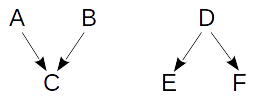
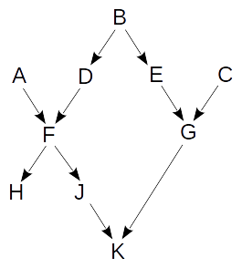

# SNAC Ark Resolution

Correct ark resolution is tricky, especially when persistent identifiers must remain persistent while allowing merging and splitting of the identities to which they refer.  Consider the following two simple examples, a merge and a split, with simplistic arks A-F.  

In the first case, the identities for arks A and B are merged together and assigned a new ark, C.  From that point on, when a user requests the identity for arks A, B, or C, they should be given the identity to which ark C is assigned.  The second case is more complicated; the identity for ark D is split apart into two new identities, each being assigned a new ark (E and F).  After this split, when a user requests the identity for ark D, they should be given the "current" form of the identity, i.e. the identities to which E and F are assigned.  The user should be presented with both or a mechanism for choosing which new identity to which they were actually referring.  In either case here, when a user requests A, B, or D, they should be notified that those arks, while still permanent, now refer to an identity better referred to by another ark.

These simplistic examples are only the building blocks of the more complex ark resolution structure we must consider.  In fact, the full merge-split history would result in a directed acyclic graph (DAG), as partly evidenced below.

Here we see three original identities assigned arks A, B, and C.  They undergo many splits and merges to result in two updated identities, those assigned arks H and K, while many other persistent identifiers are created for the intermediary identities.  When the user requests arks C, E, G, or H, they should only be given the identity for ark K; however, requesting A, B, D, or F should result in the identities (or choice thereof) for arks H and K.

| IC Numeric Identifier | IC Ark Identifier | Current Numeric Identifier | Current Ark Identifier |
|:---------------------:|:-----------------:|:--------------------------:|:----------------------:|
| 1                     | A                 | 3                          | C                      |
| 2                     | B                 | 3                          | C                      |
| 3                     | C                 | 3                          | C                      |
