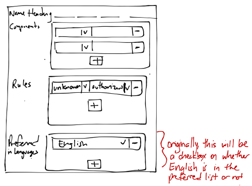

# Name Entry Specifications

## Storage and Components

Name entries have the following data:

* heading (currently called 'original'): A computed name string based on combining the components given
* components: An ordered list of name parts (`type`, `text`) based on human input
    * stored in `Component` objects
    * type is from the controlled vocabulary
* rules: A list of rule-form tuples, (`rules`, `form`), both from controlled vocabulary
    * stored in `DescriptiveRule` objects (formerly `Contributor` objects)
    * rules: descriptive rules
    * form: authorized or alternative
* preferred: List of languages for which this is the preferred name.  Each language should only show up once per Constellation among the union of all name entries' preferred lists.

In this conceptualization, we have removed the following data:

* language and script: A name entry may be the same across multiple languages, so a one-to-one mapping is not sufficient to store the language of the name entry
* preference score: The numerical value was used as a stop-gap measure for the current version of SNAC and is confusing to enter and maintain going forward

General notes:

* EAC-CPF's `<authorizedForm>` and `<alternativeForm>` tags were originally created to hold the rules, such as `RDA`.  SNAC made the decision to put the contributor or authority source in the element since the descriptive rules may not have been known.

## Conversion and Display

On importing an EAC-CPF XML record, especially from SNAC's match/merge, the following steps will need to be taken for the new structure of NameEntry:

1. Pull in the SNAC name entry text into the heading field
    * Question: do we want to copy this into the generic "Name" component as well?
2. For the name entry with the top SNAC preference score:
    * Add English/Latin to the list of preferred languages for this entity
        * For version 1, we will use English as the preferred language and show the name heading with English in the list of preferred languages
    * Add a rules entry for the name entry as (`rules` = unknown, `form` = authorizedForm)
    * For each "Contributor" or form statement in the EAC-CPF, create a new SCM entry and place the information in the `Descriptive Note` field.
        * For example, `<authorizedForm>VIAF</authorizedForm>` would be placed in the SCM note as `VIAF: authorizedForm`
    * No other rules or "Contributors" are added to the name entry
3. For every other name entry:
    * Add a rules entry for the name entry as (`rules` = unknown, `form` = alternativeForm)
    * For each "Contributor" or form statement in the EAC-CPF, create a new SCM entry and place the information in the `Descriptive Note` field.
        * For example, `<authorizedForm>VIAF</authorizedForm>` would be placed in the SCM note as `VIAF: authorizedForm`
    * No other rules or "Contributors" are added to the name entry

On viewing in the future HRT, we may make use of the `preferred` list in the Name Entries of a Constellation as follows:

* Originally, we will have SNAC be set to "English" and show the preferred English name as the default
* The goal would be to have a preferred mapping based on geography, region, and possibly policy decisions
    * For example, we may have the following:
        * **Region -> Preferred Language for Name Heading Displayed**
        * US -> English
        * France -> French
        * Canada -> English, French (Therefore, we display both for a "parallel name" view)

For the EUI, we may use the following mockup

On exporting to EAC-CPF XML, we may use the preferred mappings from the HRT view to generate parallel names

