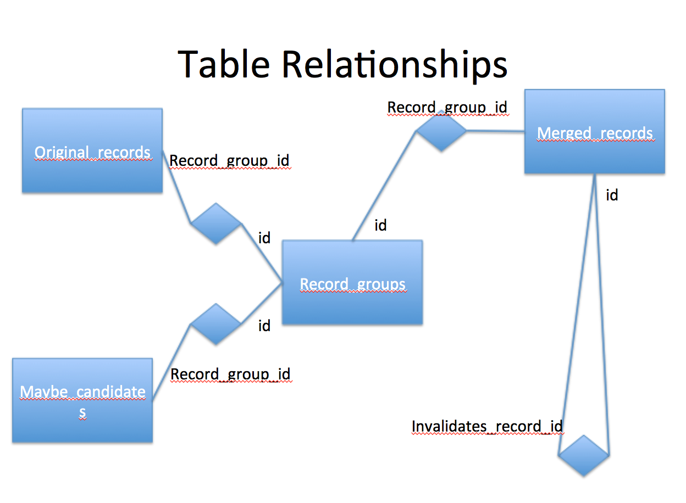

#### Authors

Tom Laudeman, Technical lead, University of Virginia, Institute for
Advanced Technology in the Humanities
[twl8n@virginia.edu](mailto:twl8n@virginia.edu)

Brian Tingle, Technical Lead for Digital Special Collections, California
Digital Library

Rachael Hu, User Experience Design Manager, California Digital Library

Ray R. Larson, U.C. Berkeley - School of Information

Robbie Hott

#### Organization of documenatation

[Plan](plan.md) (External, broad view roadmap)

[Co-op Background](co-op_background.md)  (This document) 

[Introduction ](introduction.md) (Was an introduction, but shaping up to be the requirements)

[Requirements](requirements.md) (Tech requirements from Rachael's spreadsheets)

#### co-op background

#### Introduction to SNAC

Social Networks and Archival Context (SNAC) is a Mellon-funded project
to aid end-user researchers in discovering, locating, and using
distributed historical record descriptions, especially as relates to
corporate bodies, persons, and families (CPF). These descriptions are
often in finding aids, and they often exist in electronic format. They
are distributed across many geographical locations and many networks.
SNAC brings all this data together in a central system, while retaining
links to the original descriptions. Critically, SNAC attempts to merge
descriptions for the same [matching?] CPF identities, linking those
descriptions to a single authoritative name.
^[[a]](#cmnt1)^^[[b]](#cmnt2)^

We have an existing system (SNAC one?) and need additional work to get
to a new system (SNAC 3?), so part of this document is gap analysis. The
scope of this document is to outline technical specifications and
requirements for a production system for the Cooperative
phase^[[c]](#cmnt3)^ of SNAC. This production system will handle
ingestion, processing, matching/merging, discovery, and dissemination of
archival descriptions that are submitted and added to the Cooperative.  

#### Evaluation of Existing Technical Architecture

##### Overview

This section describes the existing technical architecture, and later
moving on to describe the required functionality for the production
system for the Cooperative.

Many of the archival records that are ingested in SNAC are Encoded
Archival Context - Corporate bodies, Persons and Families (EAC-CPF,
hereafter CPF) records. EAC-CPF is an XML schema endorsed as a standard
by the Society of American Archivists. We speak of CPF descriptions in
the sense of a “computer record”: often a single text file and not a
“record” in the archival sense.

“Linked data” technology related to the Resource Description Framework
is also employed to manage some controlled vocabularies in the project.

The current system consists of three main components: extraction,
match/merge, discovery. Extraction consists of extracting data from
incoming archival description records (primarily EAD, MARC21 and some
other unique formats), to create CPF descriptions. Match/merge is to
process the CPF descriptions in search of name matches and to merge
well-matched descriptions. The resulting data set includes merged
descriptions and descriptions with no matches (called singletons), all
in a single database. Discovery is discovery and dissemination of the
data via a web application.

The production system will have two additional components: maintenance
and administration. Maintenance includes manual corrections, such as
correcting data within a description, splitting incorrect merges,
merging descriptions for the same CPF identity, and description embargo
(embargo hides descriptions from public view for either technical or
administrative reasons). Administration is the typical management of
users, accounts, and reporting on the state of the system.

The first two phases of data processing are extraction, and match/merge.
A database of descriptions, both merged and unmerged is the end
result^[[d]](#cmnt4)^. The process of ingesting extracted data and
merging will continue for the life of the project. An extensive
web-based search engine lets users discover descriptions.

We use the term “merged” loosely when applied to the automated system
since the final database may contain descriptions which should be
merged, but which a computer is unable to reliably determine.  We take a
conservative approach, preferring to only merge descriptions that a
computer program can accurately distinguish.^[[e]](#cmnt5)^ Even so,
some descriptions will have been incorrectly merged, and thus the need
for a (future) maintenance system that allows manually splitting of
descriptions, among other things.

Both Extraction and Match/merge are script based, batch processing,
semi-automatic processes managed entirely by software engineers.
Discovery and Maintenance are both web applications with extensive
public user interfaces intended for researchers. Administration is done
mostly via a non-public web application.

Extraction and match/merge are well developed, although we have some
planned improvements. Discovery is well developed, but existing features
are being refined, and adding new features is on-going. Maintenance and
administration have not yet been created and must be written from the
ground up.

#### Current State of the System

CPF description generation is done at the University of Virginia’s
Institute for Advanced Technology in the Humanities (IATH). IATH handles
the CPF data extraction and hosts servers for data processing and the
SNAC prototype web site. Data processing, XTF indexing (for the
discovery interface), and web hosting take place on a Linux server with
24 CPUs and 94 GB of RAM connected to a 1Gbit network switch. This
server is administered by the IATH sysadmin team. \

Collections of archival description computer descriptions in a variety
of formats are extracted into CPF format XML. This process involves
writing XSLT scripts that extract and transform input descriptions, and
create CPF files as output. The current state of the extraction is a
collection of XSLT scripts supplemented by Perl scripts. The input files
are XML with large numbers of files in EAD, MARC XML, and British
Library XML, as well as several smaller data sets.  A large XSLT code
library is shared among most of the extractions. Each type of extraction
builds a generic internal data structure, which is serialized as EAC-CPF
XML output. The XSLT takes into account various descriptive practices in
the input data, and reformats as necessary to create a single type of
normative CPF output. The complexity of this task centers around the
large number of small differences in descriptive practice. Currently
more than 3 million CPF computer descriptions have been created. The
XSLT processor is Saxon 9 HE, which is the free “home edition” of Saxon.
Saxon implements XSLT 2.0. There are a small number of Perl scripts that
integrate the XSLT into a pipeline, automating tasks such as chunking
data sets into sizes that won’t exceed computer memory.

The current state of the match/merge is (filled in by Yiming/Ray/Sara,
initially a one or two paragraph overview with more detail added later
as necessary).

Overview of Brian’s UI and programming for the SNAC2 XTF discovery tool
(add this to another item if there is an umbrella section more
appropriate).

Is XTF the only discovery tool we will offer? Will SNAC be fully indexed
by Google and Bing?

TK The involvement of the UC Berkeley I School includes the development,
testing and modification of the matching and merging components of the
SNAC system. The current system, described in more detail below, takes
the EAC-CPF records derived from the various source institutions and
compares the names and associated information (especial dates) to
identify the records that likely describe the same person,

organization, or family. The process involves not only comparison across
input records, but also comparison with information from the Virtual
International Authority File, and approximate matching for these records
as well.

Rachael has several user studiess. The results of these studies are... The implications of these studies
are...

The current system uses a fairly loose software development process.  Source code is maintained on a Linux
server which is managed by standard practices as relate to hardware, software, network, user accounts, back
up, and so on. All the data resides on the server. Source code is managed by version control systems. The
amount of quality assurance and testing has been increasing over time, as well as documentation, and
management aspects such as release process. All tools currently used are open source, and the code written for
SNAC is open source. We have begun to formalize feature request and issue tracking.  The development process
is agile in that there are frequent small changes that are committed to the version control, and the code is
nearly always in a working state.

#### Processing Pipeline

TK Describe algorithmic portions, and add a section for new features.

#### Extraction

There are currently several CPF extraction software pipelines: MARC21,
British Library, Smithsonian Agency History, New York State Archives,
Smithsonian Joseph Henry, Smithsonian Field Books, and EAD from nearly
60 institutions.

The first step in adding new records to the SNAC database is to convert
incoming data into EAC-CPF XML.  One EAC-CPF record is created for each
successfully extracted reference to an identity from an archival source.
The processing also allows for some degree of remediation of data
quality issues and serves to normalize the data into a common format.
 Scripting data transformation processes is a significant task that
often requires close communications with data contributors and
customizations to accommodate local practices of the contributors.

Creating an extraction is a complex process since we must deal with
variances in local descriptive practice. The MARC21 tools have been made
available as a web interface and this demonstrates the feasibility of
moving more of the processing responsibility to data donors. If we are
optimistic, we hope that EAD-to-CPF extraction and all other types of
future extractions can be turned into donor-driven tools. Specifically,
we create the tools and then deploy them as web applications and/or
desktop applications. Web hosted extraction tools allow us to leverage
the power of our servers and programmers so that data donors do not need
a large computing infrastructure in order to participate. In any case,
data must be validated before ingest into the match/merge processing.

XSLT and perl are the predominate technologies used in the generation of
the XML documents created by this process.  The code architecture
focuses on reusability of modular routines to facilitate maintenance of
the customizations needed accommodate the diversity of data sources.

Code, sample data, and documentation are in Github. The pipeline is
being run on a server, but the hardware requirements are minimal enough
that most laptop computers could run the extraction. The system requires
unix-like features of Linux, MacOS, or cygwin (for MS Windows). The XSTL
engine is Saxon 9.x HE which is the free, public version of Saxon.

#### Match/Merge

The match/merge process has three major data input streams, library authority records, EAC-CPF documents from
the EAC-CPF extract/create system, and an ARK identifier minter.

First, a copy of the Virtual International Authority File (VIAF) is indexed as a reference source to aid in
the record matching process. In addition to authorized name headings from multiple international sources, the
VIAF data contains biographical data and links to bibliographic records which will be included in the output
documents.   Then, the EAC-CPF from the extract/create process are serially processed against the VIAF and
each other to discover and rate potential matches between records. In this phase of processing, matches are
noted in a database.

After the matching phase identifies incoming EAC-CPF to merge, a new set of EAC-CPF records are
generated. This works by running through all the matches in that database, then reading in the EAC-CPF input
files, and finally outputting a new EAC-CPF records that merges the source EAC-CPF with any information found
in VIAF. ARK identifiers are also assigned.  This architecture allows for incrementally processing more
un-merged EAC-CPF documents before. It also allows matches to be adjusted in the database, or alterations to
be made on the un-merged EAC-CPF documents, and the merge records can be regenerated.

Cheshire, postgreSQL, and python are the predominate technologies used in the generation of the XML documents
created by this process.

[link to the merge output spec]

This involves processing that compares the derived EAC-CPF records against one another to identify identical
names. Because names for entities may not match exactly or the same name string may be used for more than one
entity, contextual information from the finding aids is also used to evaluate the probability that closely and
exactly matching strings designate the same entity.[1] For matches that have a high degree of probability, the
EAC-CPF records will be merged, retaining variations in the name entries where these occur, and retaining
links to the finding aids from which the name or name variant was derived. When no identical names exist, an
additional matching stage compares the names from the input EAC-CPF records against authority records in the
Virtual International Authority File (VIAF). Contextual information (dates, inferred dates, etc.) is used to
enhance the accuracy of the matching. Matched VIAF records are merged with the input derived EAC-CPF records,
with authoritative or preferred forms of names recorded, and a union set of alternative names from the various
VIAF contributors, will also be incorporated into the EAC-CPF records. When exact matching and VIAF matching
fail, then we attempt to find close variants using Ngram (approximate spelling) matching. In addition
contextual information, when available is used assess the likelihood of the records actually being the
same. Records that may be for the same entity but the available contextual information is insufficient to make
a confident match will be flagged for human review (as "May be same as"). While these records will be flagged
for human review, the current prototype does not provide facilities to manually merge records. The current
policy governing matching is to err on the side of not merging rather than merging without strong evidence.

The resulting set of interrelated EAC-CPF records will represent the creators and related entities extracted
from EAD-encoded finding aids, with a subset of the records enhanced with entries from matching VIAF
records. The EAC-CPF records will thus represent a large set of archival authority records, related with one
another and to the archival records descriptions from which they were derived. This record set will then be
used to build a prototype corporate body, person, and family name and biographical/historical access system.

In the current system all input records, and potential matches are
recorded in a relational database with the following structure:

* * * * *

[1] Using contextual information in determining that two or more records
represent the same entity has been successful in matching and merging
authority records in an international context. See Rick Bennett,
Christina Hengel-Dittrich, Edward T. O'Neill, and Barbara B. Tillett
VIAF (Virtual International Authority File): Linking Die Deutsche
Bibliothek and Library of Congress Name Authority File:
http://www.ifla.org/IV/ifla72/papers/123-Bennett-en.pdf

The the current processing steps are summarized in the following
diagram:

#### Discovery/Dissemination

#### Prototype research tool^[[f]](#cmnt6)^

The main data input for the prototype research tool are the merged
EAC-CPF documents produced in the match/merge system. Some other
supplemental data sources, such as dbpedia and the Digital Public
Library of America are also consulted during the indexing process.

A pre-indexing phase is run on the merged EAC-CPF documents. During
pre-processing, name headings and wikipedia links are extracted, and
then used to look for possible related links and data in supplemental
sources. The output of the pre-indexing phase consists of XML documents
recording supplemental.

Once the supplemental XML files are generated, two types of indexes are
created to power which serve as the input to the web site. The first
index created runs across all documents and provides access to the full
text and specific facets of metadata extracted from the documents.
Additionally, the XML structure of each document is indexed as a
performance optimization that allows for transformations to be
efficiently applied to large XML documents.

The public interface to the prototype research tool utilizes the index
across all documents to enable full text, metadata, and faceted searches
of the merged EAC-CPF documents. Once a search is completed, and a
specific merged EAC-CPF document is selected for display; the index of
the XML document structure is used to quickly transform the merged
document into an HTML presentation for the end user.

In the SNAC1 prototype a graph database was created after the full text
indexing was complete. The graph database was used to power
relationship visualizations and an API used to dynamically integrate
links to SNAC into archival description access systems. This graph
database was then converted into linked data, which was loaded into a
SQARQL endpoint. This step has not yet been implemented in the SNAC 2
prototype. Because the merged EAC-CPF documents are of higher quality
for the SNAC 2 prototype, the graph extraction process is no longer
dependent on the full text index being complete, so it could run in
parallel with pre-indexing and indexing.

XTF is the main technology used to power public access to the merged
EAC-CPF records. XTF integrates lucene for indexing and saxon for XML
transformation, making heavy use of XSLT for customization and display
of search results and the merged documents. EAC-CPF and search results
are transformed to HTML5 and JSON for consumption by the end users' web
browser. Multiple javascript and CSS3 libraries and technologies are
used in the production of the "front end" code for the website. Google
analytics is used to measure use of the site. Werker, middleman, and
bower used to build the front end code for the site.

This technical architecture

[links to code]

#### Gap analysis

This is gap analysis between the current and SNAC2-prototype. Perhaps
this should be in the Required and Planned Functionality below.

#### Data maintenance

A goal of the pilot phase it to demonstrate cooperative maintenance of
the data resource.  The prototype does not have robust support for
maintaining the corpus of EAC-CPF identity documents.

While the current architecture supports the incremental addition of new
records through input to the match/merge system there is no way to
directly create a record for a known new identity.  A workflow that
includes an archival description operator looking up identities in the
system; and creating a new record if the identity they are trying to
reference does not exist; must be supported.^[[g]](#cmnt7)^ The new
maintenance system will allow creation of a new identity record via the
web interface.

With the current architecture, textual information that comes from the
un-merged EAC-CPF documents - such as biographical history notes - could
be maintained by editing the un-merged EAC-CPF source and re-exporting
the merged EAC-CPF document.  New information could be added to the
merged documents by adding another un-merged document into the input
directory.  New un-merged EAC-CPF documents containing ARKs could be
matched directly, bypassing the match/merge searching.  It is less clear
how factual information that comes from VIAF could be modified in the
current prototype.

Early research indicates the most import section of a merged EAC-CPF
document is the section that contains links to primary and secondary
research materials about the named identity. The overarching goal of
archival description it to enable researchers to find materials relevant
to their interests. In the current prototype, the only mechanism to add
a new link into the “Archival Collections” (a more accurate label would
be “Archival Materials”) or “Related Resources” sections of links would
be to generate an un-merged EAC-CPF record with the links and add run
that through the match/merge system.

The current prototype maintains information about relationships between
the entities described by the merged EAC-CPF documents.  Currently,
“associated with” and “corresponded with” are the only two relationship
types supported.  Early research suggests that archival description
practitioners are interested in using a more extensive vocabulary of
relationship types.

[ problem of linking to EAD if the URLs are not known ]

    •    establish procedures to accepting more batch submissions

    •    XTF is not designed to handle so many documents; XTF will can
not be run in a “clustered” mode; must scale up, not scale out

    •    Cheshire II does not have a Open Source Initiative certified
license

#### Pilot phase architecture

The software will consist of a web application written in PHP, and using PostgreSQL as the data
storage. Granual work flow wil managed by a work flow engine. Hand off of tasks will be managed by a series of
semaphores. 

An Identity Reconciliation (IR) API will test similarity between two identities, and allow us to search the
database for matches. The IR API will make concrete our concept of "identity" as a collection of data fields.

CPF records will be linked to relevant recources. Brian suggest actively harvesting links through an extension
to the sitemap protocol along the lines of ResourceSync. Brian notes that the updates are based on linked
data, not submission of XML files.

#### Current State Conclusion

The current systems functions well enough for researchers and other stakeholders to see large data sets fully
processed. These systems will benefit from additional work to make them more mature in the usual ways that
software develops: robustness, testing and QA, documentation, examples, consistent API. Most of the current
software will be used in the production product.

#### Required and Planned Functionality (All authors)

(We need to break out each item into UI functionality, and API
functionality.)

#### Documentation

System documentation is in http://gitlab.iath.virginia.edu in markdown files.

Every aspect of the system requires documentation. Most visible to the public is the user interface for
discovery. Maintenance will be complicated, and our processes are somewhat novel, so this will need to be
extensive, well illustrated with screenshots, and carefully tested.

Documentation intended for developers might be somewhat sparse by comparison, but will be critical to the
on-going software development process. All the databases, operating system, httpd and other servers need
complete documentation of installation, configuration, deployment, starting, stopping, and emergency
procedures.

