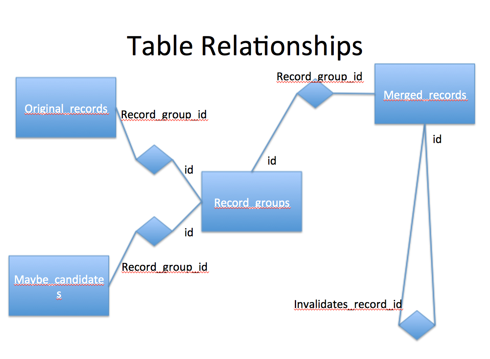

TAT Functional Requirements

#### Data background

The data is in a SQL database. Every piece of data is in a separate field to the extent that is practical.
Data is organized into fields (columns) records (rows) and tables. Fields related to each other are in the
same table. Every record has a unique, permananent, numerical id often called a "key" or "primary key". For
the SNAC Co-op we have decided that records are never overwritten during update. This is somewhat unusual, but
not unheard of. An update operation creates a new record identical to the old record except for updated
fields. All old records are available for viewing via special interface. The old records are invisible to
operations that are intellectually acting on "current" data.

#### What is "normal form" and what informs the database schema design?

Edgar F. "Ted" Codd created 12 rules (revised with a 13th rule) to clarify the Relational Database Management
System (RDBMS). 

https://en.wikipedia.org/wiki/Edgar_F._Codd

Breaking any of these rules weakens data integrity and the ability of the system to manage the data. An RDBMS
is not merely a bucket of data, but an entire eco-system for the management of data and data related
activities. Before Codd's work, databases were managed on an ad-hoc basis as collections of files with
links. It was a mess. Data was lost. Only the DBA knew how to find the data, and access methods could be very
different for data in different locations. Accessing data could also be extremely slow. In addition to
assuring the integrity of data, as well as managing it, relational database systems are very fast.

https://en.wikipedia.org/wiki/Codd%27s_12_rules

The "R" in RDBMS is "relational" and Codd invented the relational model of data. Key to relational data
modeling is "normal form".

https://en.wikipedia.org/wiki/Database_normalization

The RDBMS world generally uses third normal form. Lower levels of normalization create additional work for
data operations. Higher forms rarely show any improvements. The key concept of normalization is that a datum
only exists in one place. In the RDBMS world where SQL implements relational algebra, normal form is both
convenient and natural. In other venues such as paper ledgers, data stored in flat files, or in spreadsheets,
normal form can seem awkward.

#### Edit architecture requirements

All data is stored in the database as separate tables and fields. In theory, we can consider mixed markup, but
Brad Westbrook sugests we avoid mixed markup. From a data perspective, mixed markup is not a good
practice. Data is data, and the database schema can be modified to accomodate necessary data formats. How the
data is displayed is very much a separate issue. 

Prior to human edits, merged records can be algorithmically split by the computer, assuming we write code to
perform such a split. After human edit, a split must be performed by a human. It is a requirement that all
previous versions can be viewed (read-only) during the human-mediated split operation so the human can refer
back to previous information.

After human edits, rollback only applies to human edited versions. There is a fire-break where rollback cannot
cross from human edits back to machine-merged descriptions. The policy group needs to supply policy
requirements for the tech folks to implement.

The broad requirements for the application are: edit data, split records, merge records. Secondary features to
make the system useful include: work flow enforcement, search, reporting (including "watch" features),
administration, authorization (data privileges).

#### Expanded CPF schema requirements

Provenance and history of each element/attribute.

Unique ID per element of CPF if that element is editable.

Version control on a per-element basis.

#### Expanded Database Schema

The current database (Postgres) is sufficient for the current project
only. It will expand, and the expansion will probably be fairly
dramatic. We need to determine what tables and fields are necessary to
support additional functions. Each section of this document may need a
“data” section, or else this database schema section needs to address
every functional and UI aspect of all APIs that have anything to do with
the database.

Each field within CPF may (will?) need provenance meta data. Likewise
many fields in the database may need data for provenance.

The database needs audit trail ability to a fairly granular (field)
level. Audit is a new table at the very least. It seems likely that
nearly every table will gain some audit related fields.

Will database records be versioned? How is that handled? Seems like it
may be done via versioning table and some interesting joins. We need to
evaluate the various standard methods for database internal versioning.

CPF record has links to a “watch” table so users can watch each record,
and can watch for certain types of changes. Need UI for the watch
system. Need an API for the watch system.

Need a user table, group table, probably a group permission table so
that permissions are hard code with groups. We also want to allow
several permissions per group. Need UI for user, group, and
group-permission management.

If we create a generalized workflow system (as opposed to an ad-hoc
linked set of reports) then we need workflow tables. The tables would
establish workflow paths, necessary permissions, and would be linked to
users and groups.

Need fields to deal with delete/embargo. This may be best implemented
via a trigger or perhaps a view. By making what appear to be simple
SELECTs through a view, the view can exclude deleted records. We must
think about how using a view (or trigger) will effect UPDATE and INSERT.
Ideally the view is transparent. Is there some clever way we can
restrict access to the original table only via the view?

Need record lock on some types of records. This lock needs to be honored
by several modules, so like “delete”, lock might best be implemented via
a view and we \*only\* access the table in question via the view.

If there are different levels of review for different elements in the
record, then we need extra granularity in the workflow or the edited
record info to know the type of record edited apropos of workflow
variations.

If there different reviewers for different parts of the record, then
workflow data (and workflow configuration) needs to be able to notify
multiple people, and would have to get multiple reviewer approvals
before moving to the next phase of the workflow.

Institutional affiliation is probably common enough to want a field in
the user table, as opposed to creating a group for each institution. The
group is perhaps more generalized and could behave identical (or almost
identical) to a field (with controlled vocabulary) in the user table.

Make sure we can write a query (report) to count numbers of records
based type of edit, institution of the editor, and number of holdings.

If we want to be able to quickly count some CPF element such as outgoing
links from CPF to a given institution, then we should put those CPF
values into the SQL database, as meta data for the CPF record.

What is: How many referral links to EAC records that they created?

Be able to count record views, record downloads. Institutional dashboard
reports need the ability to group-by user, or even filter to a specific
user.

Reporting needs to help managers verify performance metrics. This
assumes that all changes have a date/timestamp. Once workflow and
process decisions are set, performance requirements for users such as
load/performance (how many updates and changes to records can be handled
at once), search response time, edit time (outside of review workflow),
and update times need to be set.

Effort reporting to allow SNAC and participants to communicate to others
the actual level of effort involved. This sounds like a report with time
span and numbers of records handled in various ways. SNAC might use this
when going from pilot into production so that everyone knows what effort
will be required for X number of records/actions (of whatever action
type).

Time/activity reporting could allow us to assess viability, utility, and
efficiency of maintenance system processes.

Similar reports might be generated to evaluate the discovery interface.
Something akin to how much time was required to access a certain number
of records. Rachael said: Assess viability of access funtionality-
performance time, available features, and ease of use.

We could try to report on the amount of training necessary before a new
user was able to work independently in each of various areas (content
input, review, etc.)

#### Introduction to Planned Functionality

The current system works, but is somewhat skeletal. It requires careful
attention from the developers to run the data processing pipelines. It
lacks administrative controls and reporting. Existing software
development process follows modern agile practices, but the some
processes are weak or incomplete. The research tools are somewhat
rudimentary. It needs infrastructure where domain experts can correct
and update merged authority descriptions.

The functional requirements below specify in detail all of the
capabilities of the new [production?] system. A separate section about
user interface (UI) specifies the visual/functional aspects of the UI
and includes discussion of the user experience (UX). Some of the
functional requirements exist only to support actions of the UI, and
UI-related functions should exist in their own independent API.

#### Software development, processes, and project management

Choices for programming languages, operating system, databases, version
control, and various related tools and practices are based on extensive
experience of the developer community, and a complex set of requirements
for the coding process. Current best practices are agile development
using practices that allow programmers wide leeway for implementation
while still keeping the processes manageable.

Test-driven development ideally means automated testing, with careful
attention to regression testing. It takes some extra time up front to
write the tests. Each test is small, and corresponds to small sections
of code where  both code and text can be quickly created. In this way,
the software is kept in a working state with only brief downtimes during
feature creation or bug fixes. Large programs are made up of
intentionally small functions each of which is tested by a small
automated test.

Regression testing refers to verifying that old bugs do not reappear.
Every bug fix has a corresponding test, even if the function in question
did not originally have a test for the bug. Each new bug needs a new
test. Bugs frequently reappear, especially in complex sections of code.

Source code version control is vital to both development process, and to
the release process. During development, frequent small changes are
checked-in to the version control, along with a meaningful comment. The
history of the code can be tracked. This occasionally helps to
understand how bugs come into existence. In the Git system, the history
command is “blame”, a bit of programmer dark humor where the history is
used to know who to blame for a bug (or any undesirable feature).

Moving code into Quality Assurance (QA) and then into the production
environment are both integral with source code management. Many version
control systems allow tagging a release with a name. The collected
source code files are marked as a named (virtual) collection, and can be
used to update a QA area. Human testing and review happens in QA. After
QA we have release. Depending on the nature of the system release can be
quite complex with many parties needing to be notified, and coordination
across groups of developers, sysadmin, managers, support staff, and
customers. Agile development tends towards small, seamless releases on a
frequent (weekly or monthly) basis where communication is primarily via
update of electronic documentation. The process needs to assure that
fixes and new features are documented. The system must have tools to see
the current version of the system with its change log, as well as
comparing that to previous releases. All of these are integrated with
change management.

Bug reporting and feature requests fall (broadly speaking) into the
category of change management. Typically a small group of senior
developers and stakeholders review the bug/feature tracking system to
assign priorities, clarify, and investigate. There are good
off-the-shelf systems for tracking bugs and feature requests, so we have
several choices. This process happens almost as frequently as the
features/bug fix coding work of the developers. That means on-going,
more or less continuous review of fix/features requests every few days,
depending on how independent the developers are. Agile applies to
everyone on the project. Ideal change management is not onerous. As
tasks are completed, someone (developers) update feature status with “in
progress”, “completed” and so on. There might be additional status
updates from QA and release, but SNAC probably isn’t large enough to
justify anything too complex.

#### QA and Related Tests for Test-driven Development

The data extraction pipelines manage massive amounts of data, and
visually checking descriptions for bugs would be inefficient if not
infeasible. The MARC extraction process is verified by just over 100
quality assurance descriptions. The output produced from each
description is checked for some specific value that confirms that the
code is working correctly and historical bugs have not reappeared. The
EAD extraction has a set of QA files, but the output verification is not
yet automated. A variety of file counts and measures of various sorts
are performed to verify that descriptions have all been processed. All
CPF output is validated against the Relax NG schema. Processing log
files are checked for a variety of error messages. Settings used for
each run are recorded in documentation maintained with the output files.
The source code is stored in a Subversion repository.

Our disaster recovery processes must be carefully documented.

The match/merge process is validated by …

#### Required new features

The majority of new features will be in two areas: the maintenance
system, and the administration system. None of this code exists. The
maintenance system has a web UI and a server-based back end that
interacts with the same database used by the match-merge. The
maintenance system also requires an authentication system (login) that
allows us to manage the extensive collaborative efforts. The current
processing of data is accomplished only on servers at the command line,
and is handled directly by project programmers. In the new maintenance
system, that will be driven by content experts via a web site, and
therefore must expect the issues of authentication and authorization
inherent in collaborative data manipulation web applications.

The system will require reports. These will cover broad classes of
issues related to managing resources, usage statistics, administration,
maintenance, and some reports for end user researchers.

(Fill in prose introducing the other subsystems such as reporting)

One important aspect of the project is long-term viability and
preservation. We should be able to export all data and metadata in
standard formats. Part of the API should cover export facilities so that
over time we can easily add new export features to support emerging
standards.

The ability to export all the data for preservation purposes also gives
us the ability to offer bulk data downloads to researchers and
collaborating peer institutions.

#### Merge and watch

Note: Ask Robbie what the database architecture is to support merged records.

Users may "watch" an identity. If a file is being watched, and that file is part of an description (merged or single) then the watch will
apply to the results of human edits, regardless of which part of the description was modified. It is possible
for someone to wish to track a biogHist, but that biogHist could be completely removed in lieu of an improved
and updated description. We do not track individual elements in CPF. We only track an entire description,
regardless the watcher’s motivation. The original motivation for watching might no longer exist after an edit,
and if so, the watcher can simply disable their watch. After each edit, all watchers will get a
notification. The watch does not apply to any single field, but to the entire description, and therefore also
to future descriptions which result from merging.

What happens to a watch on a merged description which is subsequently
split? Does the watch apply to both split descriptions or to neither
description? Perhaps is it best to disable the watch, and inform the
watcher to re-apply to watch a specific record, along with links and
helpful info to make it easy to add the new watch.

#### Brian’s API docs need to be merged in or otherwise referred to:

[https://gist.github.com/tingletech/4a3fc5f59e5af3054286](https://www.google.com/url?q=https%3A%2F%2Fgist.github.com%2Ftingletech%2F4a3fc5f59e5af3054286&sa=D&sntz=1&usg=AFQjCNEJeJexryBtHbvLw-WtFYjxP4VwlQ)

#### Not sure where to fit these topics into the requirements. Some of them may not be part of technical requirements:

Consider implementing linked data standard for relationship links
instead of having to download an entire document of links (as it is
configured now.)

Sort by common subject headings across all of SNAC - right now SNAC has
subject headings that have been applied locally without common practice
across the entire corpus.

Sort by holdings location. Sort by identity's activity location. Sort
and visualize a person through time (show dates for events in a person
or organization's lifetime). Sort and visualize an agency or
organization as it changes over time.

Continue to develop and refine context widget.

Sort collection links. Add weighting to understand which collections
have more material directly related to identity. (How is this best
handled programmatically or as an input by contributors- maybe both?).

Increase exposure of SNAC to general public by leveraging partnerships.
Suggested agreement with Wikipedia to display Wikipedia content in SNAC
biographical area and work with Wikipedia to allow for links to SNAC at
the bottom of all applicable identities. This would serve to escalate
and  drive traffic to SNAC.

#### Match/Merge

The match/merge process has three major data input streams, library
authority records, EAC-CPF documents from the EAC-CPF extract/create
system, and an ARK identifier minter.

First, a copy of the Virtual International Authority File (VIAF) is
indexed as a reference source to aid in the record matching process.  In
addition to authorized name headings from multiple international
sources, the VIAF data contains biographical data and links to
bibliographic records which will be included in the output documents.  
Then, the EAC-CPF from the extract/create process are serially processed
against the VIAF and each other to discover and rate potential matches
between records.  In this phase of processing, matches are noted in a
database.

After the matching phase identifies incoming EAC-CPF to merge, a new set
of EAC-CPF records are generated.  This works by running through all the
matches in that database, then reading in the EAC-CPF input files, and
finally outputting a new EAC-CPF records that merges the source EAC-CPF
with any information found in VIAF.  ARK identifiers are also assigned.
This architecture allows for incrementally processing more un-merged
EAC-CPF documents before. It also allows matches to be adjusted in the
database, or alterations to be made on the un-merged EAC-CPF documents,
and the merge records can be regenerated.

Cheshire, postgreSQL, and python are the predominate technologies used
in the generation of the XML documents created by this process.

[link to the merge output spec]

This involves processing that compares the derived EAC-CPF records
against one another to identify identical names. Because names for
entities may not match exactly or the same name string may be used for
more than one entity, contextual information from the finding aids is
also used to evaluate the probability that closely and exactly matching
strings designate the same entity.[1] For matches that have a high
degree of probability, the EAC-CPF records will be merged, retaining
variations in the name entries where these occur, and retaining links to
the finding aids from which the name or name variant was derived. When
no identical names exist, an additional matching stage compares the
names from the input EAC-CPF records against authority records in the
Virtual International Authority File (VIAF). Contextual information
(dates, inferred dates, etc.) is used to enhance the accuracy of the
matching. Matched VIAF records are merged with the input derived EAC-CPF
records, with authoritative or preferred forms of names recorded, and a
union set of alternative names from the various VIAF contributors, will
also be incorporated into the EAC-CPF records. When exact matching and
VIAF matching fail, then we attempt to find close variants using Ngram
(approximate spelling) matching. In addition contextual information,
when available is used assess the likelihood of the records actually
being the same. Records that may be for the same entity but the
available contextual information is insufficient to make a confident
match will be flagged for human review (as “May be same as”). While
these records will be flagged for human review, the current prototype
does not provide facilities to manually merge records. The current
policy governing matching is to err on the side of not merging rather
than merging without strong evidence.

The resulting set of interrelated EAC-CPF records will represent the
creators and related entities extracted from EAD-encoded finding aids,
with a subset of the records enhanced with entries from matching VIAF
records. The EAC-CPF records will thus represent a large set of archival
authority records, related with one another and to the archival records
descriptions from which they were derived. This record set will then be
used to build a prototype corporate body, person, and family name and
biographical/historical access system.

In the current system all input records, and potential matches are
recorded in a relational database with the following structure:

* * * * *

[1] Using contextual information in determining that two or more records
represent the same entity has been successful in matching and merging
authority records in an international context. See Rick Bennett,
Christina Hengel-Dittrich, Edward T. O'Neill, and Barbara B. Tillett
VIAF (Virtual International Authority File): Linking Die Deutsche
Bibliothek and Library of Congress Name Authority File:
http://www.ifla.org/IV/ifla72/papers/123-Bennett-en.pdf

The the current processing steps are summarized in the following
diagram:

#### Discovery/Dissemination

#### Prototype research tool^[[f]](#cmnt6)^

The main data input for the prototype research tool are the merged
EAC-CPF documents produced in the match/merge system.  Some other
supplemental data sources, such as dbpedia and the Digital Public
Library of America are also consulted during the indexing process.

A pre-indexing phase is run on the merged EAC-CPF documents.  During
pre-processing, name headings and wikipedia links are extracted, and
then used to look for possible related links and data in supplemental
sources. The output of the pre-indexing phase consists of XML documents
recording supplemental.

Once the supplemental XML files are generated, two types of indexes are
created to power which serve as the input to the web site.  The first
index created runs across all documents and provides access to the full
text and specific facets of metadata extracted from the documents.
 Additionally, the XML structure of each document is indexed as a
performance optimization that allows for transformations to be
efficiently applied to large XML documents.

The public interface to the prototype research tool utilizes the index
across all documents to enable full text, metadata, and faceted searches
of the merged EAC-CPF documents.  Once a search is completed, and a
specific merged EAC-CPF document is selected for display; the index of
the XML document structure is used to quickly transform the merged
document into an HTML presentation for the end user.

In the SNAC1 prototype a graph database was created after the full text
indexing was complete.  The graph database was used to power
relationship visualizations and an API used to dynamically integrate
links to SNAC into archival description access systems. This graph
database was then converted into linked data, which was loaded into a
SQARQL endpoint. This step has not yet been implemented in the SNAC 2
prototype.  Because the merged EAC-CPF documents are of higher quality
for the SNAC 2 prototype, the graph extraction process is no longer
dependent on the full text index being complete, so it could run in
parallel with pre-indexing and indexing.

XTF is the main technology used to power public access to the merged
EAC-CPF records.  XTF integrates lucene for indexing and saxon for XML
transformation, making heavy use of XSLT for customization and display
of search results and the merged documents.  EAC-CPF and search results
are transformed to HTML5 and JSON for consumption by the end users’ web
browser.  Multiple javascript and CSS3 libraries and technologies are
used in the production of the “front end” code for the website.  Google
analytics is used to measure use of the site.  Werker, middleman, and
bower used to build the front end code for the site.

This technical architecture

[links to code]

